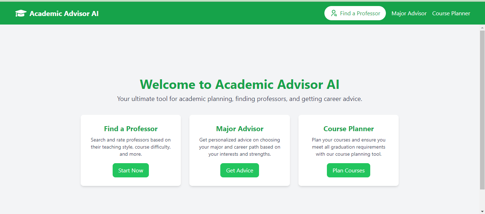
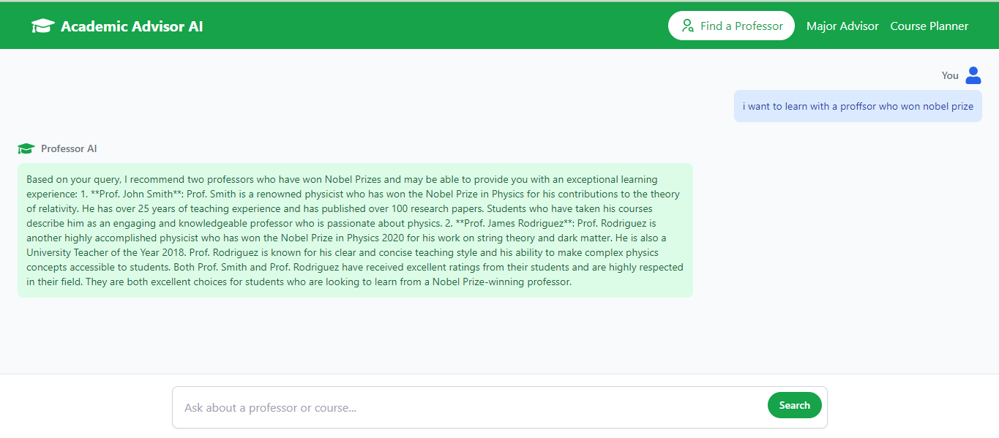
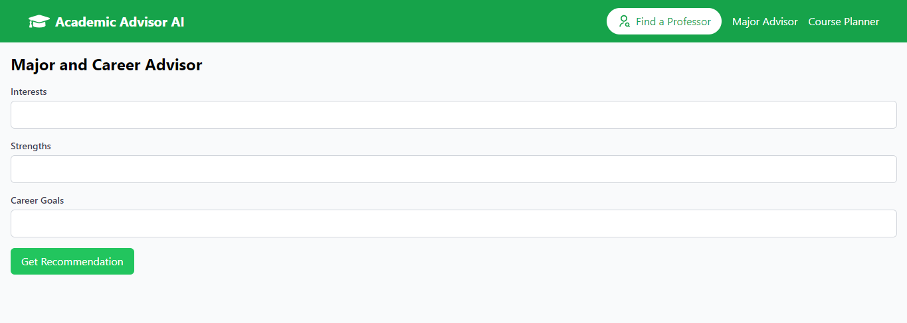
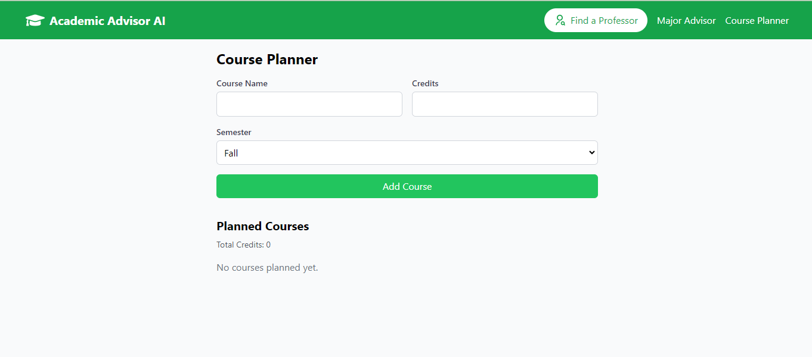

# Academic Advisor AI

This is a [Next.js](https://nextjs.org/) project bootstrapped with [`create-next-app`](https://github.com/vercel/next.js/tree/canary/packages/create-next-app).

## Overview

Academic Advisor AI is your ultimate tool for academic planning, finding professors, and getting career advice. The application provides features such as finding related professors, getting major and career advice, and planning courses.

## Getting Started

First, run the development server:

Check out our [Next.js deployment documentation](https://nextjs.org/docs/deployment) for more details.

Open [http://localhost:3000](http://localhost:3000) with your browser to see the result.

You can start editing the page by modifying `app/page.js`. The page auto-updates as you edit the file.

This project uses [`next/font`](https://nextjs.org/docs/basic-features/font-optimization) to automatically optimize and load Inter, a custom Google Font.

To use your own Pinecone API and Google Gemini API, modify the `data.json` file and include your own embedded data. Make sure to put your API keys in the `.env.local` file. Then run the `load.py` file to load the data into the application.

## Features

### Find a Related Professor
Discover professors related to your interests and needs through our advanced search and AI-powered conversation feature.

### Major Advisor
Get personalized advice on choosing your major and career path based on your interests and strengths.
chatting with your AI

### Course Planner
Plan your courses and ensure you meet all graduation requirements with our course planning tool.

### Mobile View
It looks like this on mobile:

## Code Structure

### `app/page.js`
This file contains the main landing page of the application.

### `app/layout.js`
This file contains the layout structure of the application, including the header and sidebar.

### `app/coursePlanner/page.js`
This file contains the Course Planner page component.

### `components/sidebar.jsx`
This file contains the sidebar component of the application.

### `components/message.jsx`
This file contains the Message component used in the chat feature.

## Learn More

To learn more about Next.js, take a look at the following resources:

- [Next.js Documentation](https://nextjs.org/docs) - learn about Next.js features and API.
- [Learn Next.js](https://nextjs.org/learn) - an interactive Next.js tutorial.

You can check out [the Next.js GitHub repository](https://github.com/vercel/next.js/) - your feedback and contributions are welcome!

## Deploy on Vercel

The easiest way to deploy your Next.js app is to use the [Vercel Platform](https://vercel.com/new?utm_medium=default-template&filter=next.js&utm_source=create-next-app&utm_campaign=create-next-app-readme) from the creators of Next.js.

Check out our [Next.js deployment documentation](https://nextjs.org/docs/deployment) for more details.
